# AIBOS Platform Architecture (Mermaid Diagram)

```mermaid
graph TD
    subgraph Frontend/UI/UX
        A[Web App / Dashboard]
        B[Mobile App]
    end
    subgraph API Layer
        C[FastAPI App]
        C1[Compliance Advisory API]
        C2[Compliance Analytics API]
        C3[Automation API]
    end
    subgraph Automation & Intelligence Modules
        D1[Revenue Recognition]
        D2[Disclosure Management]
        D3[Narrative Reporting]
        D4[Statement Generator]
        D5[Materiality Calculator]
        D6[ESG Reporting]
        D7[Anomaly Detection]
        D8[Disclosure Checklist]
        D9[FX Sensitivity]
        D10[Period-Close Orchestration]
        D11[Variance Analysis]
        D12[KRI Dashboard]
        D13[Disclosure Language AI]
        D14[E-File Export]
        D15[Regulatory Alerts]
        D16[Blockchain Audit]
        D17[AI Chatbot]
        D18[Benchmarking]
        D19[Transfer Pricing]
        D20[Budgeting/Forecasting]
    end
    subgraph Compliance & Reference
        E1[MFRS Rules Engine]
        E2[KPMG/Big 4 Reference]
    end
    subgraph Data Layer
        F1[Database]
        F2[Audit Trails]
        F3[External Feeds/APIs]
    end
    A-->|REST/JSON|C
    B-->|REST/JSON|C
    C-->|/compliance/advisory|C1
    C-->|/compliance/analytics|C2
    C-->|/automation/*|C3
    C1-->|calls|E1
    C1-->|calls|E2
    C2-->|calls|E1
    C2-->|calls|E2
    C3-->|calls|D1
    C3-->|calls|D2
    C3-->|calls|D3
    C3-->|calls|D4
    C3-->|calls|D5
    C3-->|calls|D6
    C3-->|calls|D7
    C3-->|calls|D8
    C3-->|calls|D9
    C3-->|calls|D10
    C3-->|calls|D11
    C3-->|calls|D12
    C3-->|calls|D13
    C3-->|calls|D14
    C3-->|calls|D15
    C3-->|calls|D16
    C3-->|calls|D17
    C3-->|calls|D18
    C3-->|calls|D19
    C3-->|calls|D20
    D1-->|data|F1
    D2-->|data|F1
    D3-->|data|F1
    D4-->|data|F1
    D5-->|data|F1
    D6-->|data|F1
    D7-->|data|F1
    D8-->|data|F1
    D9-->|data|F1
    D10-->|data|F1
    D11-->|data|F1
    D12-->|data|F1
    D13-->|data|F1
    D14-->|data|F1
    D15-->|data|F3
    D16-->|data|F2
    D17-->|data|F1
    D18-->|data|F1
    D19-->|data|F1
    D20-->|data|F1
```

---

**Text-Based Architecture Overview**

1. **Frontend/UI/UX**
    - Web and mobile apps interact with the backend via RESTful OpenAPI endpoints.
2. **API Layer (FastAPI)**
    - Exposes all compliance, analytics, and automation features as documented endpoints.
    - `/compliance/advisory`, `/compliance/analytics`, `/automation/*` (all advanced modules)
3. **Automation & Intelligence Modules**
    - Modular Python services for each automation, analytics, and AI feature (e.g., revenue recognition, FX sensitivity, AI chatbot, etc.)
4. **Compliance & Reference**
    - MFRS rules engine and KPMG/Big 4 reference modules provide compliance logic and best-practice intelligence.
5. **Data Layer**
    - Central database, audit trails, and integration with external feeds/APIs (e.g., regulatory alerts, benchmarking data).

**Flow:**
- UI/UX → FastAPI → Modular APIs → Automation/Compliance Modules → Data Layer/External Feeds
- All features are API-first, audit-ready, and designed for extensibility and analytics.
